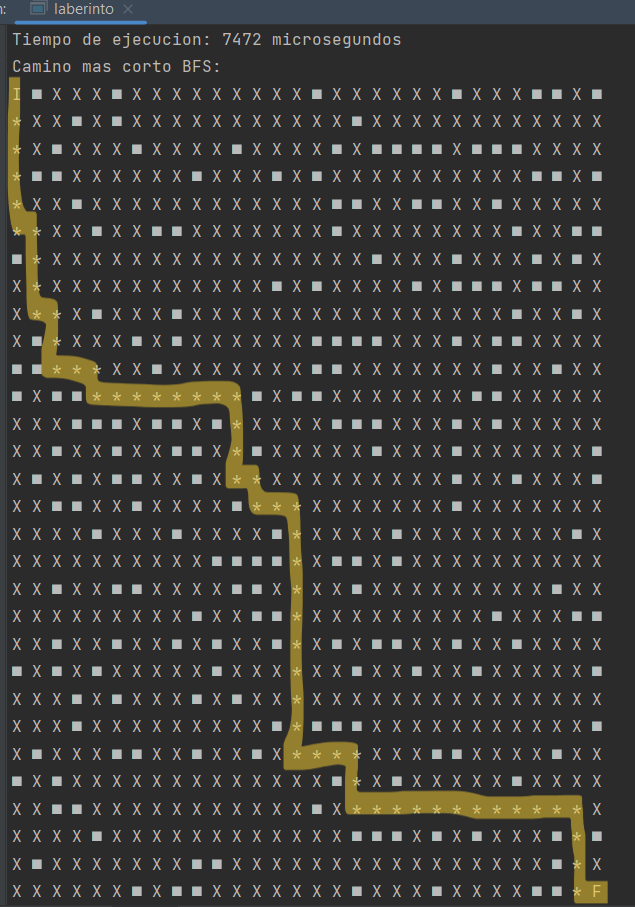

# Laberinto
Analizado a través de la perspectiva de los algoritmos DFS, BFS y Dijkstra, el laberinto experimenta un examen exhaustivo, revelando percepciones sobre sus complejidades estructurales y proporcionando una comprensión matizada de los caminos óptimos y la conectividad dentro de sus confines laberínticos.

Para utilizar este código, ejecuta el siguiente comando en la terminal:
`g++ main.cpp -o out -pthread`
Esto compila el archivo 'main.cpp', produciendo un ejecutable llamado 'out' y asegurando el soporte adecuado de hilos con la opción '-pthread'  

[Video de Exposicion](https://www.youtube.com/watch?v=QsVg6Gwcgsk&ab_channel=Jos%C3%A9AlonsoRodr%C3%ADguezMoscoso)  

## Ejemplos de Ejecución de programa
 |  | 

## Integrantes
| José Rodriguez                                    | Yoselyn Miranda                                  |
| --------------------------------------------------| -------------------------------------------------|
|   |  |
